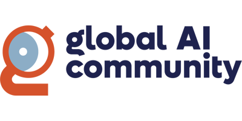
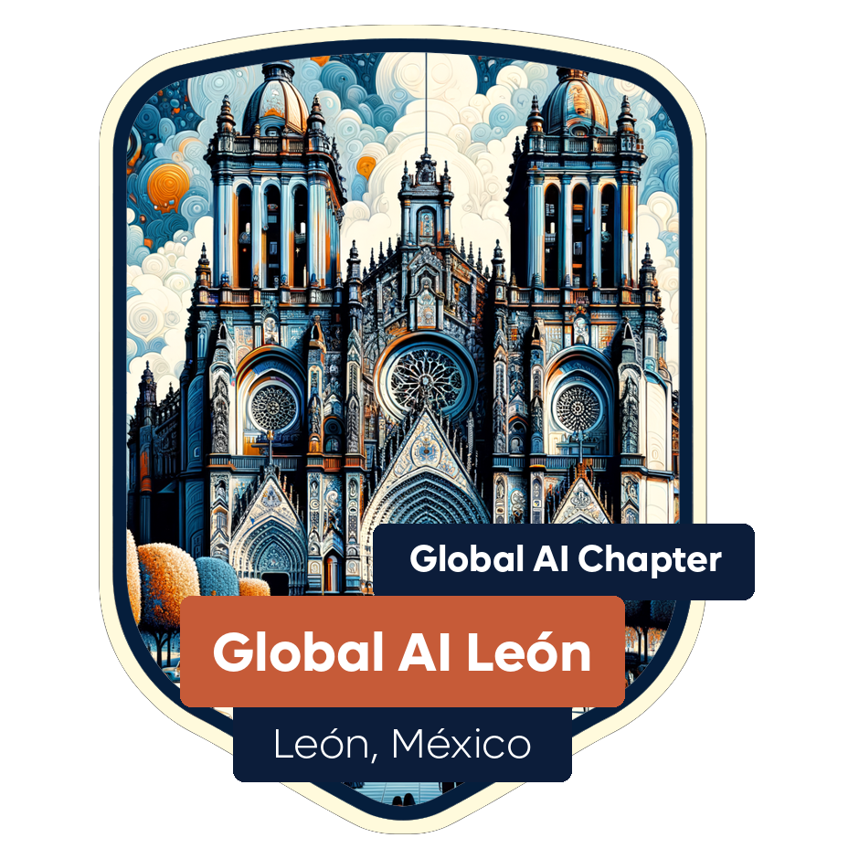
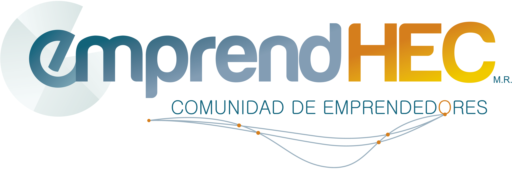
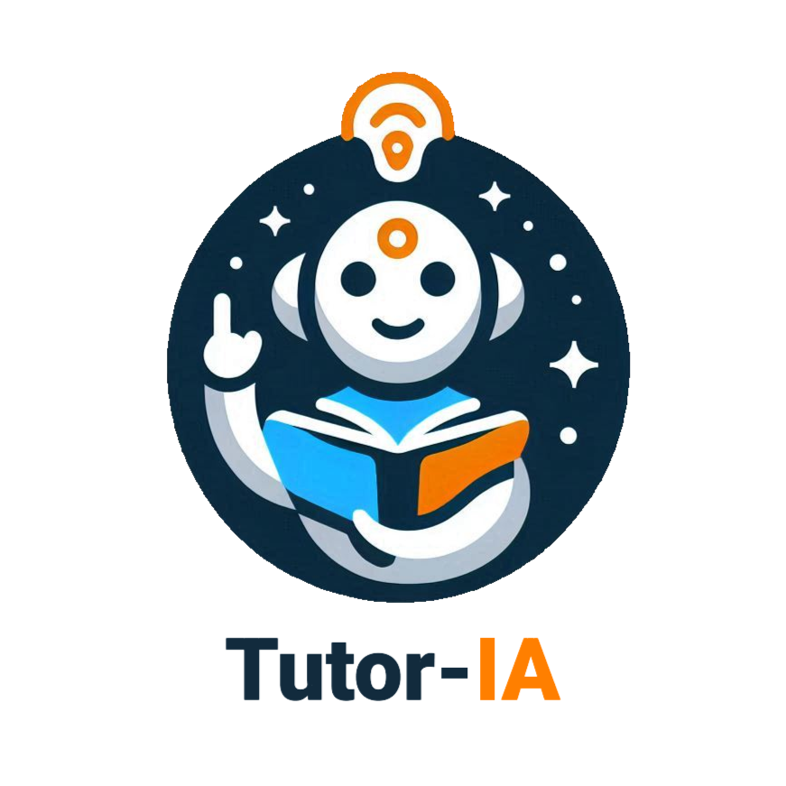
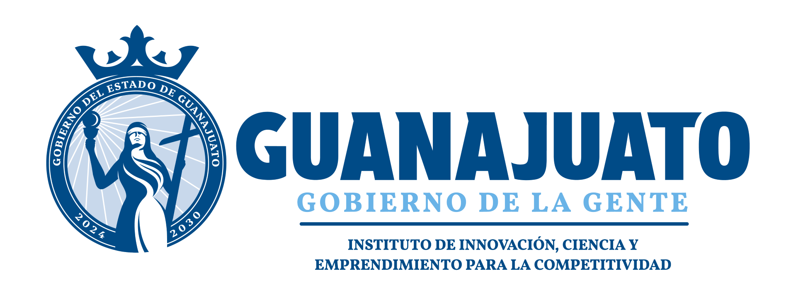

	<h1>🚀 AgentCamp Guanajuato 2026 en Silao</h1>
	
Aprende a construir y aplicar agentes de IA que transforman negocios y proyectos

	

		
📅 Viernes 9 de enero de 2026

		
🕐 10:00–14:30 hrs

		
📍 Silao, Guanajuato

	

	<a href="https://forms.office.com/r/M3tnkgYFs9" class="hero-cta" target="_blank" rel="noopener">Regístrate Ahora</a>

	<h2>🎯 Sobre el Evento</h2>
	
Evento organizado por la <strong>Global AI Community (Capítulo León)</strong> diseñado para impulsar el aprendizaje y la aplicación práctica de agentes de IA en la región del Bajío.

	
<strong>Sede:</strong> Instituto de Innovación (Puerto Interior, Silao, Gto.)

	
<strong>Registro:</strong> 9:40–10:00 | <strong>Programa:</strong> 10:00–14:30

	

	<h2>🎓 Elige tu Ruta de Aprendizaje</h2>
	

		

			<h3>💻 Creadores de IA</h3>
			
Para perfiles técnicos: ingenieros, desarrolladores y estudiantes. Talleres 100% prácticos con herramientas modernas.

			<a href="perfiles/creadores/">Ver Ruta Técnica →</a>
		

		

			<h3>📊 Aceleradores de IA</h3>
			
Para líderes de PyMEs, consultores y startups. Enfoque ejecutivo en decisiones y adopción con retorno.

			<a href="perfiles/aceleradores/">Ver Ruta Ejecutiva →</a>
		

	

	<h2>📋 Agenda del Evento</h2>
	
Consulta la <a href="agenda.html"><strong>Agenda completa</strong></a> para detalles de todas las sesiones, talleres y horarios.

	

		<strong>Horario destacado:</strong> 10:00 Bienvenida e inauguración | 10:50–12:20 Talleres Track 1 | 12:30–14:00 Talleres Track 2 | 14:00–14:30 Networking y cierre
	

	<h2>🎤 Ponentes Destacados</h2>
	
Conoce a nuestros expertos y facilitadores en la página de <a href="speakers.html"><strong>Ponentes</strong></a>:

	<ul>
		<li><strong>Luis Antonio Beltrán</strong> - Microsoft MVP en IA</li>
		<li><strong>Paulo César Ramírez</strong> - Organizador, Global AI León</li>
		<li><strong>Emiliano Castillo</strong> - Emprendedor con IA, Evior Developments</li>
		<li><strong>Diego Pérez</strong> - Data Scientist, TrueData</li>
	</ul>

	<h2>🤝 Organiza</h2>
	

		
		
	

	<h2>💼 Organizadores y Aliados</h2>
	

		
		
		
	

	<h2>📍 Logística e Información Práctica</h2>
	
Encuentra toda la información sobre dirección, tiempos de acceso, recomendaciones y más en la sección de <a href="logistica.html"><strong>Logística</strong></a>.

	<h2>📚 Recursos Complementarios</h2>
	
Enlaces útiles, comunidades, herramientas y materiales de apoyo disponibles en <a href="recursos.html"><strong>Recursos</strong></a>.

	<h2>✉️ Contacto</h2>
	
Para dudas, coordinación o más información:

	
📧 <a href="mailto:contacto@emprendhec.com"><strong>contacto@emprendhec.com</strong></a>

	
🌐 <a href="https://globalai.community/agentcamp/silao/" target="_blank" rel="noopener"><strong>Sitio oficial del evento</strong></a>

	
<strong>Nota:</strong> Algunas secciones muestran "Materiales pendientes" Pendiente y se actualizarán conforme se publiquen los contenidos de los talleres.

