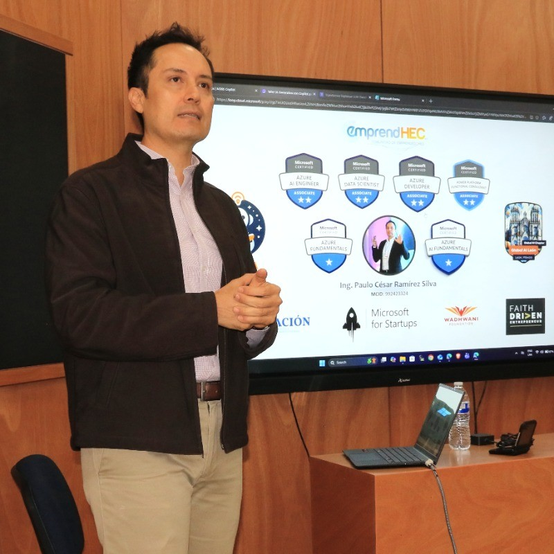

	<h2>🎤 Ponentes y Facilitadores</h2>
	
Conoce a los expertos que compartirán su conocimiento y experiencia en el AgentCamp Guanajuato 2026.

	<h2>Paulo César Ramírez Silva</h2>
	

		
		

			
<strong>EmprendHEC:</strong> Empresa líder en educación en IA para líderes, IA en educación y comunidad de IA. Ofrece capacitación ejecutiva en hiper-productividad con IA, soluciones educativas con IA y lidera la comunidad local de Global AI Community, fomentando emprendimientos digitales enfocados en asistentes y agentes de IA. Más de 21 años impactando a 20,000+ emprendedores en México.

			
<strong>Tutor-IA:</strong> Tutor educativo basado en IA para estudiantes de primaria y secundaria en Latinoamérica (6-15 años). Motiva el aprendizaje autónomo, promueve desarrollo integral socioemocional y ofrece tutoría personalizada 24/7 con énfasis en ética y valores.

			<ul>
				<li><strong>Rol:</strong> Organizador (Capítulo León, Global AI Community)</li>
				<li><strong>Sitios:</strong> <a href="https://www.emprendhec.com" target="_blank" rel="noopener">EmprendHEC</a> · <a href="https://tutor-ia.tech" target="_blank" rel="noopener">Tutor-IA</a></li>
				<li><strong>LinkedIn:</strong> <a href="https://www.linkedin.com/in/paulocesarramirezs/" target="_blank" rel="noopener">paulocesarramirezs</a></li>
				<li><strong>Sesiones:</strong> Bienvenida, charla inaugural e intervención en sesiones ejecutivas (Aceleradores de IA).</li>
			</ul>
		

	

	<h2>Luis Antonio Beltrán Prieto</h2>
	

		
		

			
Microsoft MVP en IA, experto en desarrollo de agentes inteligentes y tendencias 2026. Ofrece charlas inaugurales, talleres de mejores prácticas para creadores de IA y sesiones para aceleradores. Especialista en diseño responsable de agentes de IA, evaluación y despliegue.

			<ul>
				<li><strong>Reconocimiento:</strong> Microsoft MVP en IA</li>
				<li><strong>Sitio:</strong> <a href="https://luisbeltran.mx/" target="_blank" rel="noopener">luisbeltran.mx</a></li>
				<li><strong>LinkedIn:</strong> <a href="https://www.linkedin.com/in/luisantoniobeltran/" target="_blank" rel="noopener">luisantoniobeltran</a></li>
				<li><strong>Sesiones:</strong> Charla inaugural sobre tendencias 2026, taller de mejores prácticas para Creadores de IA, y sesión para Aceleradores de IA.</li>
			</ul>
		

	

	<h2>David Emiliano Castillo García</h2>
	

		
		

			
Empresa de alto impacto tecnológico en LATAM, enfocada en soluciones de IA, drones autónomos, robótica colaborativa, impresión 3D sostenible y transformación social. Desarrolla prototipos innovadores para agricultura sostenible, salud y educación, impactando a millones con tecnología que conecta y transforma.

			<ul>
				<li><strong>Perfil:</strong> Emprendedor especializado en IA</li>
				<li><strong>Empresa:</strong> <a href="https://eviordevelopments.com/" target="_blank" rel="noopener">Evior Developments</a></li>
				<li><strong>LinkedIn:</strong> <a href="https://www.linkedin.com/in/emiliano-castillo-040042336/" target="_blank" rel="noopener">emiliano-castillo-040042336</a></li>
				<li><strong>Sesiones:</strong> Taller de técnicas y herramientas de prototipado con IA (Creadores), y co-facilitación en sesión para Aceleradores.</li>
			</ul>
		

	

	<h2>Diego Pérez Hernández</h2>
	

		
		

			
Especialistas en ingeniería de datos con enfoque en simplicidad e inteligencia adecuada. Ofrecen gestión de datos, inteligencia de datos y dominio de datos para autonomía operativa. Desarrollan Semantic Suite para búsqueda semántica empresarial y soluciones replicables como RINGR y servicios de facturación automatizados.

			<ul>
				<li><strong>Perfil:</strong> Data Scientist / Emprendedor</li>
				<li><strong>Empresa:</strong> <a href="https://www.truedata.com.mx/" target="_blank" rel="noopener">TrueData</a></li>
				<li><strong>LinkedIn:</strong> <a href="https://www.linkedin.com/in/diego-ph/" target="_blank" rel="noopener">diego-ph</a></li>
				<li><strong>Sesiones:</strong> Taller de prototipado con IA (Creadores), y co-facilitación en lecciones para PyMEs (Aceleradores).</li>
			</ul>
		

	

	
<strong>¿Quieres conocer más sobre sus sesiones?</strong> Revisa la <a href="agenda.html">Agenda completa</a> para ver los horarios y temas específicos.

